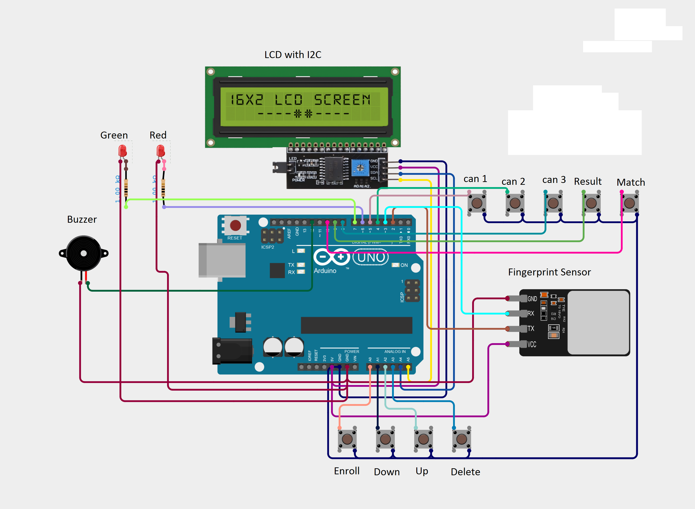
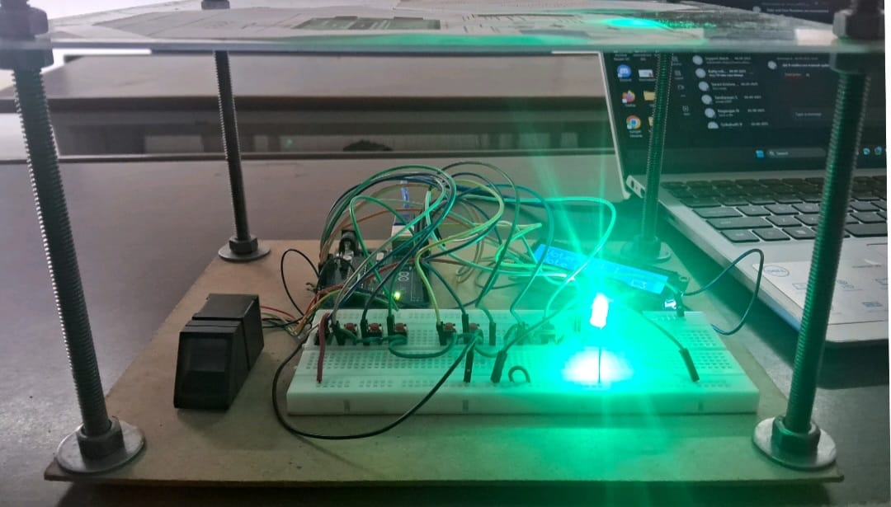

# 🗳️ Fingerprint Voting System using Arduino

This project is a **biometric-based voting system** that uses a fingerprint sensor to ensure secure and duplicate-free voting. Each voter is authenticated using their fingerprint before casting a vote.

---

## 🚀 Features

- 🔐 Secure voting using fingerprint authentication  
- ❌ Prevents duplicate voting  
- 📊 Displays voting results  
- 🔔 Buzzer indication for actions  
- 💡 LED indicators for status  
- 🔘 Button-based voting system  

---

## 🛠️ Components Used

- Arduino UNO  
- Fingerprint Sensor Module  
- I2C LCD Display  
- Push Buttons  
- Buzzer  
- LEDs (Red & Green)  
- Resistors (1KΩ)  
- Jumper Wires  
- Breadboard / PCB  

---

## 🔌 Circuit Connections

### 📟 I2C LCD → Arduino UNO
- VCC → 5V  
- GND → GND  
- SDA → A4  
- SCL → A5  

### 🔐 Fingerprint Sensor → Arduino UNO
- Red → 5V  
- Black → GND  
- Yellow (TX) → D2  
- Green (RX) → D3  

### 🔔 Buzzer → Arduino UNO
- Positive (+) → D12  
- Negative (-) → GND  

### 🔘 Push Buttons → Arduino UNO  
*(All buttons share common GND)*

- Candidate 1 → D5  
- Candidate 2 → D4  
- Candidate 3 → D8  
- Result Button → D9  
- Match Button → D10  
- Delete Button → A1  
- UP Button → A2  
- DOWN Button → A3  
- OK Button → A0  

### 💡 LED Connections → Arduino UNO

- 🟢 Green LED  
  - Anode (+) → D6 (via 1KΩ resistor)  
  - Cathode (-) → GND  

- 🔴 Red LED  
  - Anode (+) → D7 (via 1KΩ resistor)  
  - Cathode (-) → GND  

---

## 📸 Project Images

### 🔧 Circuit Diagram

### 🧪 Prototype

### 📊 Output

---

## 💻 Code

The Arduino code is available in:
 
[fingerprint_voting_system.ino](./fingerprint_voting_system.ino)

Upload it using Arduino IDE after installing required libraries.

---

## 📚 How It Works

1. System initializes and waits for user input  
2. User places finger on sensor  
3. If fingerprint matches:
   - Voting options are enabled  
4. User selects candidate using buttons  
5. Vote is recorded and stored  
6. Duplicate voting is prevented  
7. Results can be viewed using result button  

---

## ⚙️ Requirements

- Arduino IDE  
- Adafruit Fingerprint Library  
- LiquidCrystal_I2C Library  

---

## 📌 Future Improvements

- Cloud-based vote storage ☁️  
- Mobile app integration 📱  
- Face recognition support 🤖  
- IoT-based remote monitoring  

---

## 👨‍💻 Author

**Abishek**  
Electronics & Communication Engineering  

---

## ⭐ If you like this project

Give it a ⭐ on GitHub!
